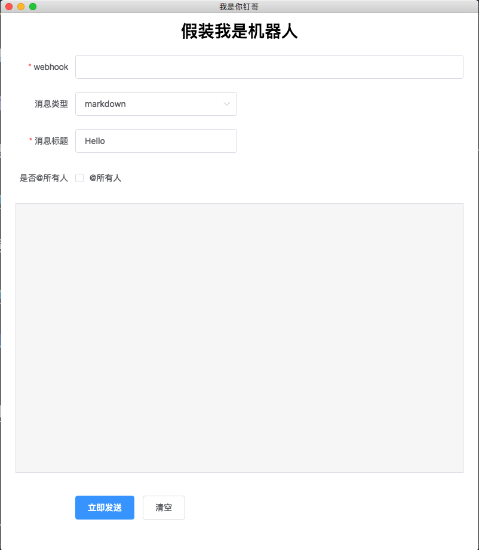

# dingding-robot-play

钉钉自定义机器人，消息发送工具

曾几何时，你有否想过，自己是一个*机器人*？那么来吧，**小钉哥** 帮你实现梦想

# 下载

* Windows: [64bit](https://github.com/DFocusFE/dingding-robot-play/releases/download/1.0.0/dingBot-win32-x64.tar.gz)
* Mac 11.11+: [64bit](https://github.com/DFocusFE/dingding-robot-play/releases/download/1.0.0/dingBot-darwin-x64.tar.gz)

## 为钉钉创建自定义机器人

随便找一个你想要骚浪贱的**群**，进去，依次点开`群管理` => `机器人管理`，点击“添加机器人”，拉到最后，找到`自定义`卡片，如下图


编辑头像，填写机器人名称，点击“完成添加”。来到如下图界面：


点击“复制”按钮，即可获得这个机器人对应的 `Webhook` 地址，其格式如下

```bash
https://oapi.dingtalk.com/robot/send?access_token=xxxxxxxx
```

点击“完成”即可。

然后，打开我们的“我是你钉哥”工具，如下图：



在`webhook`处填写刚才复制好的地址，然后填写内容，点击发送吧。

于是，那就可以愉快的冒充机器人与大家聊天咯
